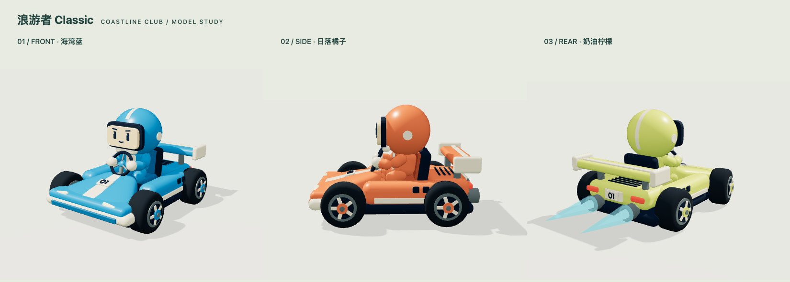

# 浪游者 Classic 造型重做

2026-10-01。参考早期《跑跑卡丁车》的圆润、短宽、低重心比例，重新设计游戏当前使用的赛车和车手；没有使用原作模型或贴图。

造型参考：[官方棉花糖系列介绍](https://popkart.tiancity.com/homepage/guide/guide_racing02.html)。

- 短鼻翼和横向保险杠，奶油白中线、车灯与 01 号码牌。
- 宽胎、五辐轮毂、低底盘、两侧包围和独立尾翼。
- 圆头盔与小脸、手套握住方向盘、膝盖弯曲坐在开放座舱内。
- 双排气口配双束氮气尾焰，长度沿排气口向后变化。
- 海湾蓝、日落橘子、奶油柠檬，玩家和五名 AI 共用新版比例。

实际游戏直接调用 `apps/web/src/game/kart-model.ts` 建模。合并刚性部件的同材质网格，保留四个转向枢轴与四个轮轴，车身可以随漂移倾斜。没有修改驾驶、计圈、AI 或碰撞参数。

`npm run assets:kart` 从同一建模函数导出 `/models/classic-kart.glb`，经 Meshopt 压缩后约 201 KiB，30,438 个三角形。导出保留车手和独立轮组，隐藏的运行时尾焰不导出。工坊默认展示新版；初代 Rodin 模型保留为收藏，棕榈和岩石继续用于赛道。清单明确区分原创程序建模与 Rodin 来源。

检查了三种颜色、正面/侧面/后方、车库近景、比赛追尾视角与尾焰；展示图可通过 `node scripts/capture-kart.mjs` 重现。17 项规则/服务测试、4 组浏览器测试通过，包含普通转向与漂移下 A/D/左右箭头的方向检查、10 局三圈完赛、五名 AI 完赛、计时练习与存档。TypeScript 和生产构建通过。

相关产物：

- [实际车库](screenshots/classic-garage.png)
- [比赛视角](screenshots/race.png)
- [模型渲染记录](classic-model-validation.json)
- [生产静态预览检查](classic-production-validation.json)
